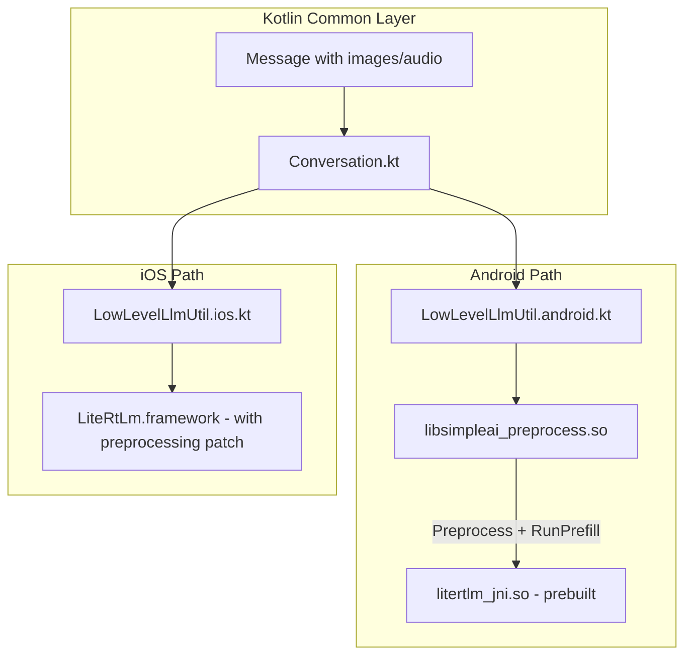

# Multimodal Preprocessing Shim Plan

## Problem Summary

The LiteRT-LM Session API requires images/audio to be **preprocessed into TensorBuffers** before calling `RunPrefill`. Currently, both your iOS and Android implementations pass raw bytes, which causes the "Image must be preprocessed" error.

The preprocessing pipeline must:

1. **Images**: Decode PNG/JPG -> Resize to 768x768 -> Normalize [0,255] to [0.0,1.0] floats -> TensorBuffer
2. **Audio**: Decode WAV -> Resample to 16kHz mono -> Compute mel spectrogram (FFT + mel filterbank) -> Normalize with USM constants -> TensorBuffer

---

## Architecture Overview



---

## Part 1: iOS Implementation (Modify C API Patch)

Since you can rebuild the C code for iOS, the cleanest approach is to enhance the existing `build_ios.sh` patch to include preprocessing directly in the C API.

### 1.1 Enhance `patch_engine_files()` in `build_ios.sh`

The current patch creates `InputImage(std::string(raw_bytes))`. Modify it to:

1. Add `#include` for `StbImagePreprocessor` and `AudioPreprocessorMiniAudio`
2. In `litert_lm_session_run_prefill`:

   - For `kInputImage`: decode/resize/normalize using `StbImagePreprocessor::Preprocess()`
   - For `kInputAudio`: compute mel spectrogram using `AudioPreprocessorMiniAudio::Preprocess()`
   - Create `InputImage(TensorBuffer)` / `InputAudio(TensorBuffer)` instead of raw bytes

Key code changes needed in the patch:

```cpp
// Add these includes in the patch
#include "runtime/components/preprocessor/stb_image_preprocessor.h"
#include "runtime/components/preprocessor/audio_preprocessor_miniaudio.h"

// In litert_lm_session_run_prefill, replace raw InputImage creation with:
case kInputImage: {
  litert::lm::StbImagePreprocessor preprocessor;
  litert::lm::ImagePreprocessParameter params;
  params.SetTargetDimensions({1, 768, 768, 3});  // Gemma3 default
  auto raw_image = litert::lm::InputImage(std::string(...));
  auto result = preprocessor.Preprocess(raw_image, params);
  if (result.ok()) {
    engine_inputs.emplace_back(std::move(*result));
  }
  break;
}
```

### 1.2 Update BUILD file patch

The `patch_build_file()` function needs to add dependencies:

- `//runtime/components/preprocessor:stb_image_preprocessor`
- `//runtime/components/preprocessor:audio_preprocessor_miniaudio`

### 1.3 Files to modify

- [litertlmBuildScripts/build_ios.sh](litertlmBuildScripts/build_ios.sh): Enhance `patch_engine_files()` and `patch_build_file()`

---

## Part 2: Android Implementation (New NDK Shim Library)

Since you cannot modify the prebuilt `litertlm_jni.so`, create a separate native library that handles preprocessing and calls back into the existing library.

### 2.1 New Native Library Structure

Create a new directory structure:

```
composeApp/src/androidMain/
├── cpp/
│   ├── CMakeLists.txt
│   ├── preprocess_shim.cpp       # Main preprocessing + JNI
│   ├── image_preprocessor.cpp    # stb_image wrapper
│   ├── image_preprocessor.h
│   ├── audio_preprocessor.cpp    # miniaudio + mel spectrogram
│   ├── audio_preprocessor.h
│   └── third_party/
│       ├── stb_image.h
│       ├── stb_image_resize2.h
│       └── miniaudio.h
```

### 2.2 JNI Interface Design

The shim exposes new JNI functions that:

1. Accept raw image/audio bytes from Kotlin
2. Preprocess them into float arrays
3. Construct proper `InputImage(TensorBuffer)` / `InputAudio(TensorBuffer)`
4. Call the Session's `RunPrefill` and `GenerateContentStream`

Key JNI functions:

```cpp
// New JNI class: SimpleAIPreprocessJni
extern "C" {
  // Initialize with session pointer from existing JNI
  JNIEXPORT void JNICALL nativeInitWithSession(JNIEnv*, jclass, jlong sessionPtr);
  
  // Prefill with preprocessing
  JNIEXPORT void JNICALL nativeRunPrefillWithMedia(
      JNIEnv*, jclass,
      jlong sessionPtr,
      jobjectArray inputs  // Array of PreprocessedInput objects
  );
  
  // Stream decode with callback
  JNIEXPORT jint JNICALL nativeGenerateContentStreamWithMedia(
      JNIEnv*, jclass,
      jlong sessionPtr,
      jobjectArray inputs,
      jobject callback  // StreamCallback interface
  );
}
```

### 2.3 Critical Challenge: Accessing Session Internals

The prebuilt `litertlm_jni.so` creates `Engine::Session*` pointers that are passed as `jlong` to Kotlin. The shim needs to call `session->RunPrefill()` with preprocessed data.

**Solution**: The shim needs to:

1. Receive the session pointer (`jlong`) from Kotlin
2. Cast it to `Engine::Session*` (this requires compatible ABI - should work since same NDK version)
3. Call methods on it directly

This requires including LiteRT-LM headers in the shim build. The headers define the `Session` interface but the implementation is in the prebuilt `.so`.

### 2.4 Gradle/CMake Configuration

Add to `composeApp/build.gradle.kts`:

```kotlin
android {
    externalNativeBuild {
        cmake {
            path = file("src/androidMain/cpp/CMakeLists.txt")
        }
    }
    ndkVersion = "28.0.12433566"  // Match your existing NDK
}
```

### 2.5 Kotlin Wrapper

Create new file: `composeApp/src/androidMain/kotlin/com/aayush/simpleai/util/PreprocessShimJni.kt`

```kotlin
object PreprocessShimJni {
    init {
        System.loadLibrary("simpleai_preprocess")
    }
    
    external fun nativeRunPrefillWithMedia(
        sessionPtr: Long,
        inputs: Array<PreprocessInput>
    )
    
    external fun nativeGenerateContentStreamWithMedia(
        sessionPtr: Long,
        inputs: Array<PreprocessInput>,
        callback: StreamCallback
    ): Int
}

sealed class PreprocessInput {
    data class Text(val text: String) : PreprocessInput()
    data class Image(val bytes: ByteArray) : PreprocessInput()
    data class Audio(val bytes: ByteArray) : PreprocessInput()
    object AudioEnd : PreprocessInput()
}
```

### 2.6 Files to create/modify

- `composeApp/src/androidMain/cpp/CMakeLists.txt` (new)
- `composeApp/src/androidMain/cpp/preprocess_shim.cpp` (new)
- `composeApp/src/androidMain/cpp/image_preprocessor.cpp` (new)
- `composeApp/src/androidMain/cpp/audio_preprocessor.cpp` (new)
- `composeApp/src/androidMain/kotlin/com/aayush/simpleai/util/PreprocessShimJni.kt` (new)
- `composeApp/build.gradle.kts` - add CMake configuration
- `composeApp/src/androidMain/kotlin/com/aayush/simpleai/util/LowLevelLlmUtil.android.kt` - use new shim for media

---

## Part 3: Image Preprocessing Details

Both platforms need the same logic (reference: `stb_image_preprocessor.cc`):

1. **Decode**: Use `stbi_load_from_memory()` to decode PNG/JPG
2. **Resize**: Use `stbir_resize()` to resize to target dimensions (768x768 for Gemma3)
3. **Normalize**: Convert uint8 [0,255] to float32 [0.0, 1.0]
4. **Output**: Float array of shape `[1, height, width, 3]` in NHWC format

Target dimensions can be configured (768x768 default for Gemma3/Gemma3N).

---

## Part 4: Audio Preprocessing Details

Reference: `audio_preprocessor_miniaudio.cc` and USM config.

Pipeline:

1. **Decode WAV**: Use miniaudio to decode and resample to 16kHz mono
2. **Pre-emphasis**: Apply factor 0.97
3. **STFT**: Frame length 512, hop length 160, FFT length 1024
4. **Mel filterbank**: 128 mel bins, 125-7500 Hz range
5. **Normalize**: Apply USM mean/stddev constants (128 float values each)
6. **Output**: Float array of mel spectrogram frames

This is more complex than image preprocessing - approximately 250 lines of C++ code.

---

## Part 5: Build Script Updates

### 5.1 Android Build Script

Create `litertlmBuildScripts/build_android_shim.sh`:

- Downloads stb headers and miniaudio
- Invokes Gradle to build the native library
- Verifies the `.so` is created

### 5.2 iOS Build Script

Modify `litertlmBuildScripts/build_ios.sh`:

- Enhance `patch_engine_files()` with preprocessing code
- Add preprocessor dependencies to BUILD file patch

---

## Implementation Order

1. **iOS first** - simpler since you can modify C code directly
2. **Android image preprocessing** - get images working with the shim
3. **Android audio preprocessing** - add mel spectrogram computation
4. **Streaming support** - add async callback wrappers

---

## Dependencies

**Third-party headers (header-only, no linking required):**

- `stb_image.h` - image decoding (~8000 lines, single header)
- `stb_image_resize2.h` - image resizing (~4000 lines, single header)  
- `miniaudio.h` - audio decoding (~100k lines, single header)

All are MIT/public domain licensed and widely used.

---

## Risk Assessment

- **iOS**: Low risk - straightforward C code modification, same pattern as existing patch
- **Android ABI compatibility**: Medium risk - shim calls into prebuilt `.so` methods; requires same NDK version and compatible headers
- **Audio complexity**: Higher complexity than images due to FFT/mel computations

---

## Testing Strategy

1. Test image preprocessing standalone (decode + resize + verify dimensions)
2. Test audio preprocessing standalone (verify mel spectrogram shape matches reference)
3. Integration test with actual Gemma3 multimodal model
4. Verify streaming callbacks work correctly